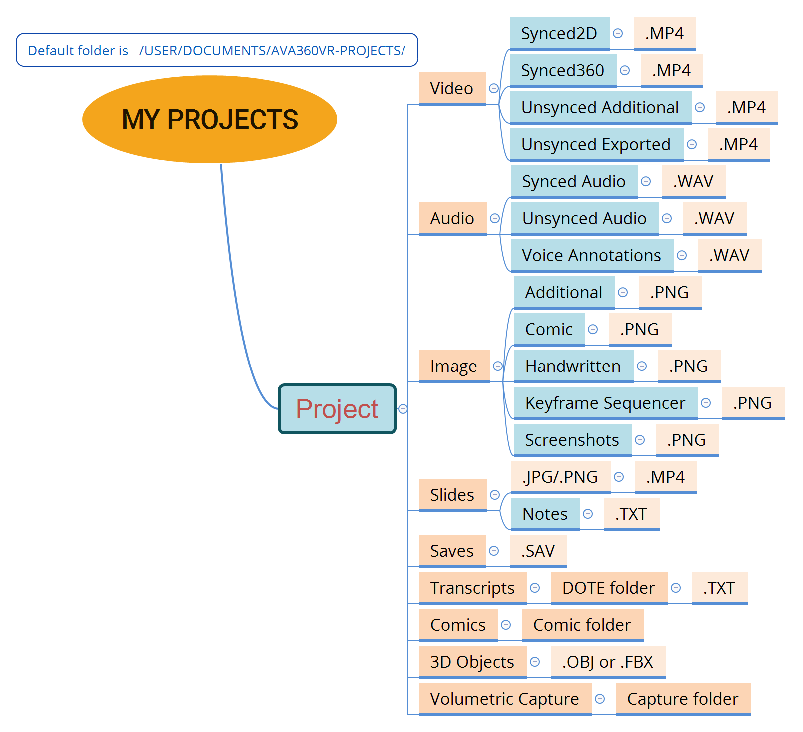

## Making a new project

This is a guide how to create a new project with your own data.

### Preparing audio and video clips

All the synced audio and video clips to be used in a project need to be synced together so that they have the same IN and OUT points and therefore they are all of the same time duration.
This must be done outside of _AVA360VR_.
We have produced an [online video](https://youtu.be/FWZy9PK_ODw) that gives instructions how to synchronise multiple video files and export them as clips with identical IN and OUT timecodes.

#### Synced 360 video clips

- The resolution and bit rate of the 360 video should be as high as possible, otherwise the video playback will be blocky and blurred in VR.
Use the raw footage and render at a high bit rate using the camera software (or _MistikaVR_).
- Stitch the raw footage carefully so that the stitch lines between lenses are not too visible.
- With mobile 360 cameras use stabilisation while filming or stabilise later in the camera software.
_MistikaVR_ has tools for re-stabilising, but it is not free and it takes some effort.

#### Synced audio clips

#### Unsynced audio and video clips

### Preparing transcripts

### Preparing images

### Preparing 3D models

### Creating a new project

It is recommended that you store all of your related projects in the same root folder, eg. `MY AVA360VR PROJECTS`.
If you do this, then you can easily jump between projects while in VR using the analysis mapping tool.

After loading _AVA360VR_, choose `Create Project`, then select the root folder where all your projects will be stored on your drive, type the project name, select the 360 video file you wish to make the master 360 (it will be copied into the new project automatically), and finally give a name for your first analysis.
You can have many analyses in one project, eg. each with a different combination of visible video clips, audio clips, drawings, animations, etc.

Once the project is created, you can then open any of the analyses you have created or start a new analysis in the same project.

Each project should contain copies of all the files that available to be imported.
It will also be where any exported files (eg. recammed 2D video clip, keyframe sequences, screenshot, comic panel generator) will be stored.

### Adding files to the new project

Every _AVA360VR_ project has the same folder structure as shown in the following diagram.

If you named your project `MY PROJECT`, then every subfolder is important and should not be renamed.
This folder structure will guide you where to copy all the files.
When you created the project, the master 360 video was copied automatically to the correct subfolder `MY PROJECT/Video/Synced360/`.
Now you need to copy any other audio-visual files into the correct subfolders.
For example, if you have a synced audio file (eg. a wireless microphone), then copy the file into the `MY PROJECT/Audio/Synced Audio/` subfolder.

### Importing assets in AVA360VR

Once you have completed copying manually all the relevant files, then they will be available in _AVA360VR_ from the `IMPORT` menu on the left controller.
